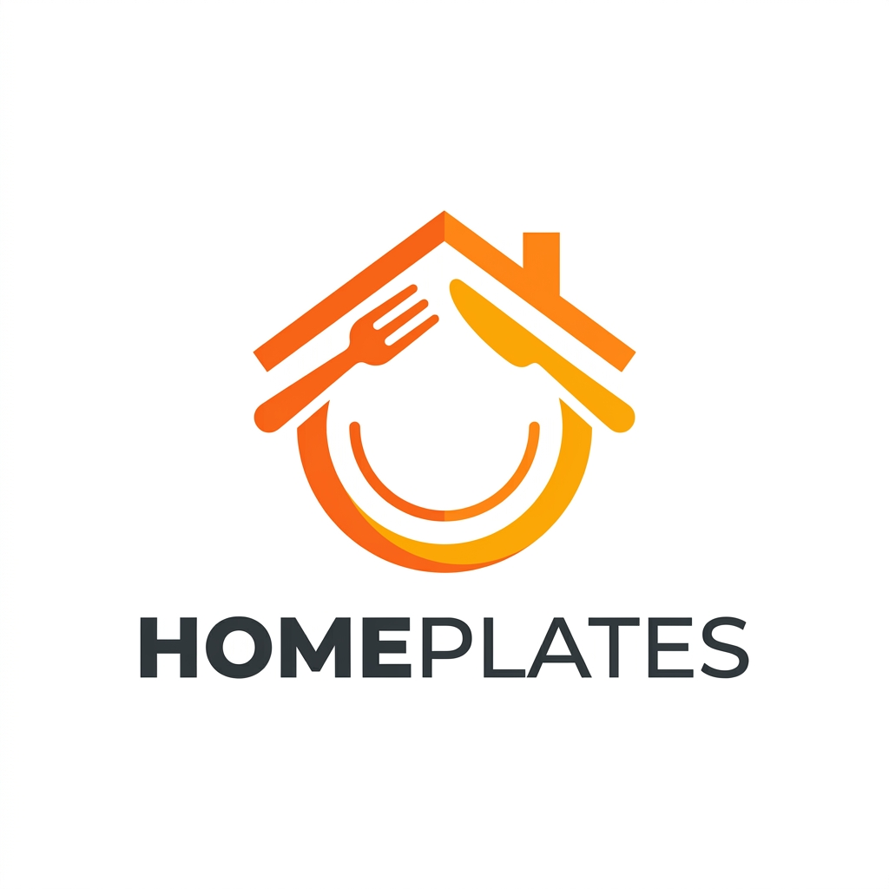
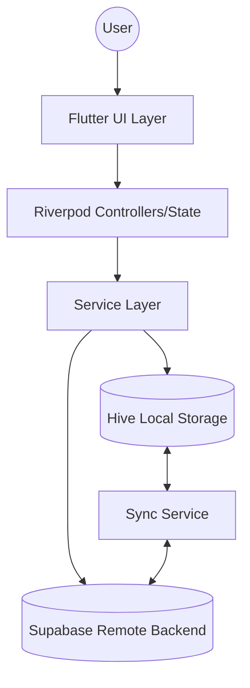

<div align="center">
  
  <h1>HomePlates</h1>
  <p><strong>A Next-Generation Homemade Food Delivery & Culinary Community Platform</strong></p>

  [](https://flutter.dev/)
  [](https://dart.dev/)
  [](https://supabase.com/)
  [](#)
</div>

---

## 📖 Overview

**HomePlates** is a comprehensive, multi-role food marketplace connecting local home chefs with food enthusiasts and delivery riders. Built with production-grade Flutter, the application provides three distinct user experiences (Customer, Chef, Rider) seamlessly integrated within a single unified codebase.

The architecture emphasizes strict separation of concerns, robust local-first caching strategies, and a scalable real-time backend powered by Supabase.

## 🏗 Architecture Overview



## ✨ Key Features

### 🧑‍🍳 For Chefs
* **Dish Management**: Add, edit, and toggle availability of culinary creations.
* **Order Tracking**: Real-time order queue management and status updates (Pending → Preparing → Ready for Pickup).
* **Analytics Dashboard**: Track earnings, top-performing dishes, and customer reviews.
* **Subscription Models**: Flexible tier-based subscriptions for increased platform visibility.

### 🍽️ For Customers
* **Discovery & Filtering**: Advanced search capabilities with dynamic category filtering and personalized recommendations.
* **Live Order Tracking**: Real-time map integration to track riders from the kitchen to the doorstep.
* **Community Feed**: Social networking features to discover trending dishes, follow favorite chefs, and share food reviews.
* **Secure Checkout**: Streamlined multi-step checkout with multiple payment options and promotional code support.

### 🛵 For Riders
* **Route Optimization**: Live map integrations with optimal routing to the chef and customer locations.
* **Earnings Tracker**: Transparent payout history and active delivery monitoring.
* **Status Updates**: One-tap status syncing across the platform network.

## 🛠️ Technical Stack & Architecture

### Frontend
* **Framework**: Flutter (Dart)
* **State Management**: [Riverpod](https://riverpod.dev/) for predictable, compile-safe state propagation.
* **Local Storage**: [Hive](https://docs.hivedb.dev/) for rapid, local-first data caching and offline support. Models are strongly typed using `hive_generator`.
* **Routing**: Declarative, role-based navigation guarding.
* **Styling**: Centralized `AppTheme` utilizing `ThemeData`, dynamic dark mode support, and custom typography (Google Fonts).

### Backend (Supabase)
* **Database**: PostgreSQL with Row Level Security (RLS) policies.
* **Authentication**: Secure email/password and social OAuth flows.
* **Real-time Sync**: WebSockets for immediate order status and chat updates.

### Code Quality & Standards
* **Strict Linting**: Configured with strict `flutter analyze` rules, enforcing zero warnings/errors in the production build.
* **Null Safety**: 100% sound null safety implementation avoiding dangerous `!` assertions in async gaps.
* **Context Safety**: Robust handling of `BuildContext` across async gaps (`if (!context.mounted) return;`).

## 📁 Project Structure

```text
lib/
├── controllers/       # Business logic controllers coordinating services and UI
├── data/
│   ├── local/         # Hive local database models and adapters
│   └── remote/        # Supabase API clients
├── providers/         # Riverpod global state providers
├── screens/           # UI Screens grouped by role/feature
├── utils/             # Theme tokens, formatters, and global constants
└── widgets/           # Reusable, stateless UI components
```

## 🚀 Getting Started

### Prerequisites
* Flutter SDK (Latest stable channel recommended)
* Dart SDK
* Supabase project credentials

### Installation

1. **Clone the repository:**
   ```bash
   git clone https://github.com/manahillkhitab/HomePlates.git
   cd HomePlates
   ```

2. **Install dependencies:**
   ```bash
   flutter pub get
   ```

3. **Code Generation:**
   Generate the Hive adapter models (if modifying data models):
   ```bash
   flutter packages pub run build_runner build --delete-conflicting-outputs
   ```

4. **Environment Setup:**
   Ensure you have configured your `Supabase` URL and Anon Key in the `lib/utils/constants.dart` or `.env` equivalent.

5. **Run the App:**
   ```bash
   flutter run
   ```

## 🧪 Testing
The application includes a comprehensive suite of unit and widget tests focusing on registry integrity, state management logic, and UI rendering.
```bash
flutter test
```

## 🛡️ Security Highlights
* Hardened async handlers to prevent silent failures and context crashes.
* Strictly scoped `TypeID` registries for local Hive databases to ensure schema integrity across updates.
* GDPR compliant data handling protocols in synchronization services.


## 📸 Project Showcase

> [!NOTE]
> This section is reserved for real screenshots of the application running on a device. To showcase your work, replace these placeholders with your own authentic screenshots!

<div align="center">
  <table style="width: 100%">
    <tr>
      <td align="center"><br><b>Customer App</b></td>
      <td align="center"><br><b>Chef Dashboard</b></td>
      <td align="center"><br><b>Rider Tracking</b></td>
    </tr>
  </table>
</div>

---
<div align="center">
  <p>Built with ❤️ for the love of homemade food.</p>
</div>
